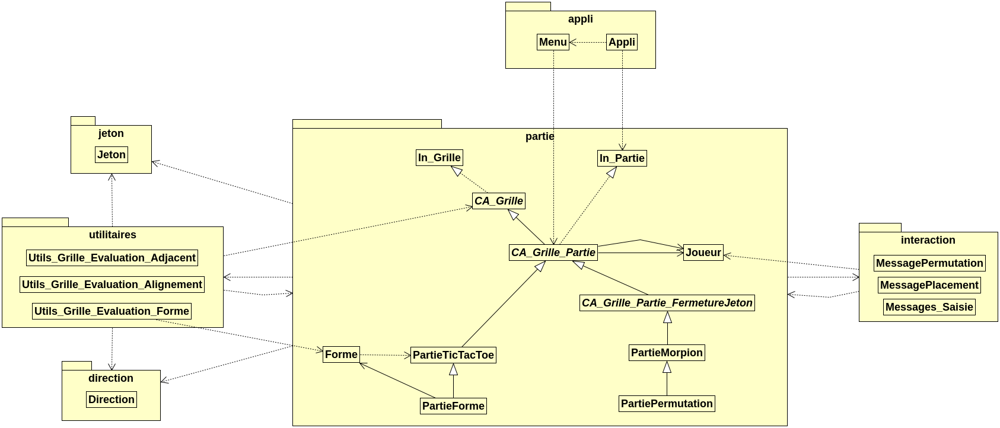

# OOP-TicTacToe

IUT Paris Descartes - 2019 - Enseignant : POITRENAUD Denis.

## Algorithme et Programmation en JAVA.

Dans le cadre du cours de Bases de la programmation orientée objet en JAVA, Denis Poitrenaud a proposé de développer un jeu : Le Tic-Tac-Toe, aussi appelé Morpion et OxO en Belgique.

## Auteur

JALLAIS Adrien : <adrien.jallais@protonmail.com>  

## Utilisation

La fonction ***main*** se trouve dans le fichier **Appli.java** du package **appli**.

Au chemin suivant : [OOP-TicTacToe/src/appli](/OOP-TicTacToe/src/appli/Appli.java).

Veuillez tapez dans les argurments des paramètres du lancement de l’application :

+ < 0 > Pour la selection d un jeu via un menu interactif.
+ < 1 > Pour jouer au TicTacToe.
+ < 2 > Pour jouer au Morpion.
+ < 3 > Pour jouer au TicTacToe extension Forme.
+ < 4 > Pour jouer au Morpion extension Permutation.

## Diagramme de classe

Un diagramme de classe representant les relations entre ces applications est accessible au chemin suivant :
*OOP-TicTacToe/OOP-Diagram.png*.

